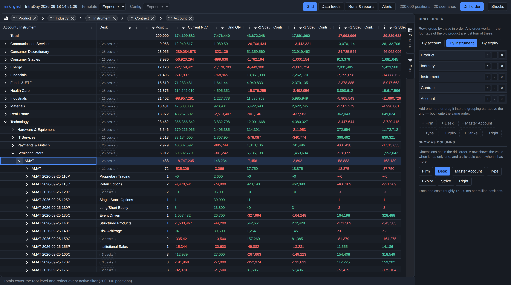

# risk_grid

Browser-based post-trade stress and position analytics for broker-dealers.

Replacing the Citrix-delivered legacy systems that pivot a firm's post-trade
book by instrument and account level, showing greeks, reference data, and P&L
under configurable historical-stddev shock templates.

## What works today

A running stack: a synthetic book of any size, valued and stressed, served
through a pivot API into a browser grid.

- **Pivot any way.** One composable request — an ordered dimension list, an
  expansion path, filters, measures — replaces what the incumbent hardcodes as
  four toolbar tabs. Drill account → instrument or instrument → account.
- **Expand in place.** Parents stay visible, several branches open at once, so
  you can compare siblings instead of losing your place.
- **Counts you can click.** A dimension that is not the grouping key shows its
  value when the group holds one, and otherwise a chip — `2,528 accounts` —
  that regroups underneath the row when clicked. That is the incumbent's
  useless `[21]` cell turned into the cross-dimension drill.
- **Shock configs and column templates**, edited live. Templates address
  scenarios by `(price, vol)` coordinate, so changing the config reports which
  columns it can no longer supply instead of silently repointing them.
- **Pinned totals** that describe exactly the rows on screen, worst-of-sum.
- **Onboarding as configuration.** Upload a firm's export, confirm the guessed
  column mapping, see what comes out, save. Named transforms handle the awkward
  things real exports do — unsigned quantities with a side column, accounting
  negatives, strikes in thousandths, vol as a percent.
- **Validation that quarantines** rather than half-loading. A truncated file
  that loads is worse than one that errors.
- **Alerts that are saved pivots.** "Any sector whose Max Risk is below -10MM"
  is a group-by plus a post-aggregation filter, so the alert engine is the pivot
  engine. Alerts on transition by default, not every batch.
- **Scheduled reports** as a picture of the view plus the same rows as CSV.
- **Multi-tenant**, with position data isolated per firm by both authorisation
  and containment — a query process serves exactly one firm and refuses the rest.
- **Batches are persisted**, so restarting costs 1.2s instead of repricing, and
  the root level of every dimension answers from a rollup in under a millisecond.



## Running it

Works the same on macOS, Linux and Windows — configuration lives in a file, so
no command below needs shell-specific environment-variable syntax.

```bash
pip install -e ".[dev]"
cp .env.example .env          # copy on Windows too; edit if you like
```

Then, in four terminals or one at a time:

```bash
# 1. Control plane, a firm, and an API key.
python -m control.bootstrap --firm acme --name "Acme Securities" --email ops@acme.test

# 2. Build a batch. A separate process from the query service on purpose.
python -m risk.build --firm acme --synthetic 200000

#    ...or ingest a real file through a saved mapping profile.
python -m ingest.worker --firm acme --once

# 3. Query service.
python -m uvicorn api.main:app --port 8000

# 4. Frontend.
cd web && npm install && npm run dev        # http://localhost:5173
```

**Save the token bootstrap prints.** Only its SHA-256 is stored, so it cannot be
recovered — but it takes one command to replace:

```bash
python -m control.keys issue --email ops@acme.test    # mint a new one
python -m control.keys list                           # prefixes, never secrets
python -m control.keys revoke --prefix 7e45a61a
```

Put it in `web/.env.local` (gitignored) as `VITE_API_TOKEN=rg_...` — the
`keys issue` output prints the exact line.

`.env.example` documents every setting. Two worth knowing:

- **`RISK_GRID_FIRM` should stay unset locally.** It is the containment guard: a
  process refusing to serve any firm but its own. Unset, the service runs
  multi-firm and the caller's own firm decides, which is what a laptop wants.
  Deployed, each container sets it, so a routing mistake cannot reach another
  firm's data even with valid credentials.
- **Without `RISK_GRID_SMTP_HOST`, reports and alerts print to the console**
  rather than sending. A report that appears to send and does not is worse than
  one that obviously did not.

<details>
<summary>If you would rather use environment variables than a file</summary>

A real environment variable always beats `.env`, so either works.

```bash
RISK_GRID_FIRM=acme python -m uvicorn api.main:app --port 8000   # bash/zsh
```
```powershell
$env:RISK_GRID_FIRM = "acme"                                      # PowerShell
python -m uvicorn api.main:app --port 8000
```
```bat
set RISK_GRID_FIRM=acme
python -m uvicorn api.main:app --port 8000
```
</details>

Deployment topology and costs are in [docs/hosting.md](docs/hosting.md).
AG Grid Enterprise runs unlicensed with a watermark; set `VITE_AG_GRID_LICENSE`
to clear it.

```bash
pytest                          # 200 tests
python spikes/perf_spike.py     # the scaling table
python spikes/storage_spike.py  # persistence, rollups, retention cost
python spikes/eep_error.py      # pricing approximation study
```

## Why it scales

Shock P&L is independent per position and aggregation is a sum, so the
position × scenario matrix is built once and every pivot is a groupby-sum over
it. The browser never receives positions — only the children of the expanded
node, about 13 KB. Full numbers in [docs/architecture.md](docs/architecture.md).

## Layout

| Path | What |
|---|---|
| `risk/pricing.py` | Vectorized Black-Scholes + greeks, Bjerksund-Stensland American |
| `risk/scenarios.py` | Shock grids: flat percent or per-underlying sigma units |
| `risk/engine.py` | Base valuation and the position × scenario P&L matrix |
| `risk/aggregate.py` | Composable pivots, distinct-value cells, totals |
| `risk/batch.py` | Snapshot identity, batch store, rollups, aggregate cache |
| `risk/storage.py` | Parquet artifacts, manifest, local and S3 backends |
| `risk/build.py` | Build worker: reprice, write artifacts, index the batch |
| `config.py` | `.env` loading; a real environment variable always wins |
| `control/` | Firms, users, API keys, batch index, audit log, views, reports, alerts |
| `ingest/` | Canonical schema, field mapping, validation, connectors, the pipeline |
| `alerting.py` | Alert rules, evaluated with the pivot engine |
| `notify/` | Report rendering, screenshots, email delivery |
| `risk/templates.py` | Column templates and shock configs |
| `risk/synthetic.py` | Realistically-shaped synthetic book generator |
| `api/` | FastAPI, AG Grid server-side row model contract |
| `web/` | React + AG Grid Enterprise frontend |
| `spikes/` | Performance and accuracy studies |
| `docs/` | [Strategy](docs/strategy.md), [architecture](docs/architecture.md), [hosting](docs/hosting.md), [operations](docs/operations.md) |
