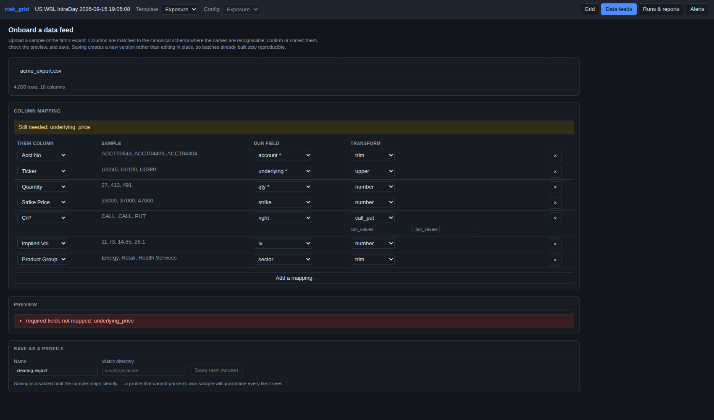
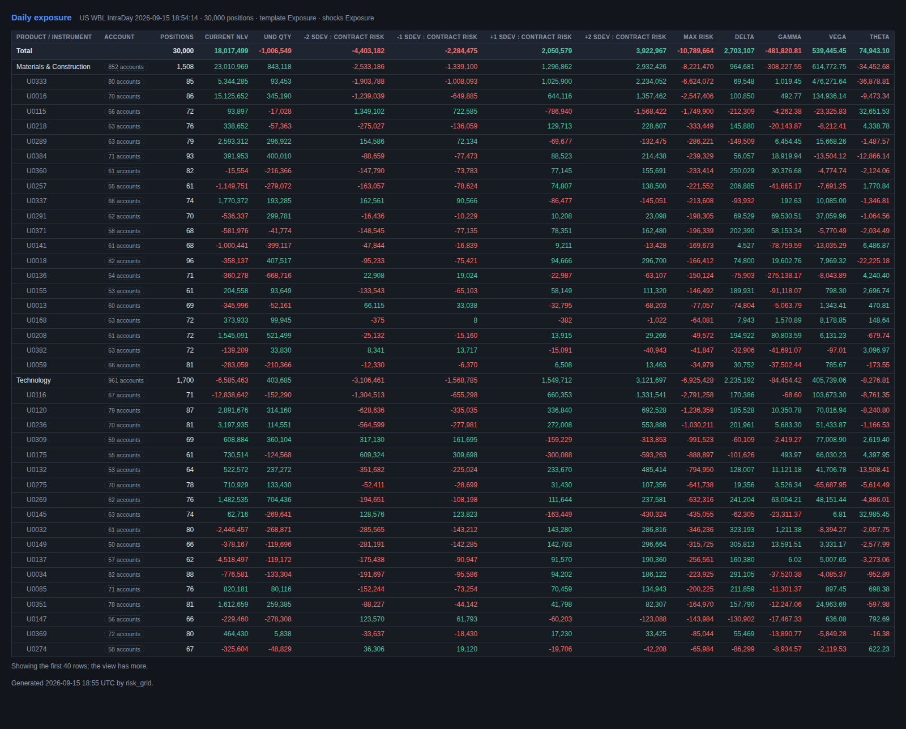

# risk_grid — operations

Onboarding a firm, getting their data in, and getting numbers back out
automatically. Covers the admin layer, reporting and alerting.

---

## Onboarding is configuration, not code

The incumbents' moat is dozens of bespoke clearing-file parsers — that is most
of what a $200K contract actually buys (see `docs/strategy.md` §3). Inverting it
is the whole point of this layer: a new firm is a **form**, not a pull request.

The flow is upload a sample, confirm the guessed mapping, look at what comes
out, save.



### The canonical schema

Deliberately small — the fewer fields a firm must supply, the shorter onboarding
is. Only four are required:

| Required | Derived if absent | Defaulted |
|---|---|---|
| `account`, `underlying`, `qty`, `underlying_price` | `instrument_type` (from the strike), `multiplier`, `dte` (from expiry), `contract`, `master_account`, `sigma_daily` | `desk`, `firm`, `sector`, `strike`, `expiry`, `right`, `iv`, `rate`, `div_yield` |

An option is a line with a strike, so a firm need not map an instrument-type
column at all.

### Transforms

Every transform is a named, parameterised operation, so the awkward things real
exports do are configuration rather than a parser:

| Transform | What it handles |
|---|---|
| `number` | Thousands separators, currency symbols, and `(1,234)` accounting negatives |
| `scale` | Strikes sent in thousandths, vol sent as a percent |
| `signed_by` | Unsigned quantity with a separate LONG/SHORT column — loading this without the sign reports a flat book as doubly long |
| `call_put` | `CALL`/`C`/`1`/`Calls` all becoming `C` |
| `date` | A named format, falling back to the common ones |
| `map_values` | Explicit lookup for codes only that firm understands |
| `trim`, `upper`, `abs`, `negate`, `identity` | The ordinary cases |

Column names are matched against a synonym table to pre-fill the form. Guesses
are shown for confirmation, never applied silently.

### Profiles are versioned

Saving creates a **new version** rather than editing in place. Last quarter's
batches were built under the old mapping and have to stay reproducible; a firm
changing their export must not silently reinterpret history.

Saving is refused while the sample does not map cleanly — a profile that cannot
parse its own sample would quarantine every file it ever sees.

---

## Getting data in

```
fetch -> map -> validate -> reprice -> write -> register -> alert -> report
```

`python -m ingest.worker --firm acme --once` runs it. Every attempt is recorded
on an `IngestionRun` whether or not it worked, because the question an ops person
actually asks is *what happened to the 9:30 file*, and "nothing in the logs" is
not an answer.

### Connectors

| Kind | Settings |
|---|---|
| `local` | `directory`, `pattern`, `archive` — also where HTTPS pushes land |
| `s3` | `bucket`, `prefix`, `suffix` — ours or the firm's |
| `sftp` | `host`, `port`, `username`, `directory`, `key_path` — host key must be known; unknown hosts are refused rather than trusted on first use |

### Validation, and why it quarantines

The failure that hurts is not a file that errors. It is a file that **loads**: a
truncated export, a column that quietly became null, a strike field that shifted.
Each produces a batch that looks fine and is wrong, and a risk screen nobody can
trust is worse than no risk screen.

So errors quarantine the file — no batch is built, the file is kept with the
reason beside it — while warnings build the batch and are recorded against it.

| Check | Severity |
|---|---|
| Required field null or absent | error |
| Option with no strike, already expired, or a right that is neither C nor P | error |
| Underlying price ≤ 0 on more than 1% of rows | error (warning below that) |
| Row count ±50% against the previous batch | error (warning at ±20%) |
| Implied vol absent, or above 500% | warning — the latter suggests the `scale` transform |
| Zero quantity | warning |
| **A validation rule that could not run** | **error** |

That last one is deliberate. An earlier version downgraded a crashed rule to a
warning, which let a file with nulls in a required field pass *as validated*
because the sampling helper had thrown. A file nobody managed to check is not a
checked file.

### One honest gap

Historical sigma properly comes from a price history, not a position file. When
a firm does not supply `sigma_daily`, the shock template is calibrated from
implied vol instead — usable, but the run says which it got rather than leaving
anyone to assume it was calibrated properly.

---

## Alerting

**A rule is a saved pivot plus a threshold.** "Any sector whose Max Risk is worse
than -10MM" is a group-by on sector with a post-aggregation filter on `worst`,
which `risk/aggregate.py` already does and already tests. There is no second
query language: a rule serialises to a `PivotRequest`, firing means the result
came back non-empty, and the rows that came back are the email.

- **Scope** narrows the book before aggregation (only options, only this desk).
- **Conditions** test the aggregate afterwards. That distinction is why a
  threshold on Max Risk means what a user expects.

### Transition by default

Alerting every batch about the same standing breach, at a 30-minute intraday
cadence, is how people learn to ignore alerts. So the default is **once, when it
starts breaching**, with per-group state to tell a new breach from a continuing
one. `every_batch` is available and the UI says what it will cost you.

A breach that clears is recorded as resolved, so the same group can fire again
later. Resolution is not currently notified — a reasonable next addition.

### Test before saving

The rule editor evaluates against the latest batch without saving or sending.
A threshold nobody has checked against real data either never fires or fires on
everything.

Rules are evaluated **after the batch registers**, never before: an alert that
fires on a batch nobody can open yet sends people to a screen that is not there.

---

## Reporting

A report is a saved view plus a schedule and recipients. It sends a picture of
the view and the same rows as CSV.



### Why the report is rendered server-side

A virtualised grid screenshots badly: only the visible rows exist in the DOM, so
capturing the real app gets one viewport of a report that should be a hundred
rows. Driving the SPA headless also means an authenticated browser context,
waiting on lazy block loads, and re-expanding the tree — three things that fail
intermittently on a schedule nobody is watching.

So `notify/render.py` renders the view as a plain non-virtualised table and
screenshots that with Playwright. The cost is a second renderer whose styling has
to stay recognisably like the grid's; the benefit is that it is deterministic,
needs no browser session, and shows every row rather than every visible row.

The CSV comes from the pivot rather than the rendered page, so the numbers are
full precision rather than whatever fitted in a cell.

### Failures are surfaced

A report that silently stops arriving is unnoticed for a month, so `run_reports`
returns its failures rather than swallowing them, the reason is stored on the
report row, and the admin screen shows it. An earlier version caught and
`continue`d, which hid a missing browser for exactly as long as you would expect.

---

## Not built yet

- **No scheduler.** Reports and the ingestion poller have `schedule` fields and
  run on demand; nothing yet fires them on a cron. That is the next piece.
- **Late-drop alerting.** `grace_minutes` is stored but nothing watches for a
  batch that never arrived — and silence is the failure mode that actually hurts.
- **Slack.** The `Notifier` interface exists so it slots in without touching the
  scheduler, alert engine or renderer; only SMTP is implemented.
- **HTTPS push ingestion.** Files can land in a watched directory, but there is
  no authenticated upload endpoint yet.
- **Secrets.** SFTP credentials are passed to the connector by the caller; the
  control plane stores connector settings in plain JSON and should hold a secret
  reference instead.
- **Per-user report subscriptions.** Recipients are a list on the report, not
  linked to users.
